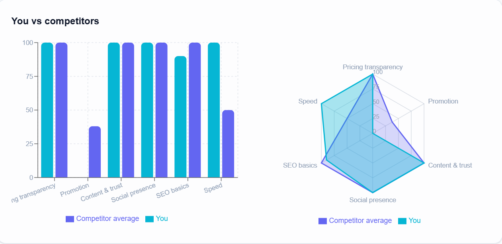

# Competitor Monitor

Compare your website and social channels against your competitors. Get a scored comparison, prioritized recommendations and a short summary, free to run.

**Live demo:** https://competitor-monitor-tau.vercel.app
**Code:** https://github.com/dani3430/competitor-monitor



## The problem

Small businesses often don't know how they compare to their competitors, and market research tools are expensive. Checking ten websites by hand takes hours and gives no clear answer.

Competitor Monitor turns a few links into a scored comparison and a short, ranked to-do list.

**Example:** an online shop owner enters their site and three competitors. The report shows that all three competitors offer free shipping and a clear pricing page, while the owner has neither. The owner gets a to-do list instead of a vague feeling that "competitors seem ahead".

## Features

- Enter your own website and social links, then up to 4 competitors. Only one link per brand is required.
- Scores out of 100 for pricing transparency, promotion, content and trust, SEO basics, speed and social presence
- YouTube channel analysis: upload frequency and average views, from the public feed
- Bar chart comparing you with the competitor average
- Prioritized recommendations (high, medium, low) and a list of your strengths
- Short summary written by AI when available, with an automatic rule-based fallback
- Animated "analysis" screen, dark and light mode, responsive layout, reduced-motion support
- Saved past reports (in your own browser) and PDF export

## How it works

1. The browser sends the links to a Next.js API route (`/api/analyze`).
2. The server downloads each public page and reads it with Cheerio: prices, offers and promotions, headings, calls to action, social links, meta tags and response time.
3. A scoring module turns those signals into scores and compares you with the competitor average.
4. Gaps become recommendations, ranked by size.
5. The report appears immediately with a rule-based summary. A second request (`/api/summary`) asks the Gemini free tier for a written summary and swaps it in when it arrives. If the AI is busy or the free limit is reached, the rule-based summary stays.

Requests to private or local addresses are blocked, so the server can't be used to probe internal networks.

## Tech stack

| Area       | Tools                                                   |
| ---------- | ------------------------------------------------------- |
| Frontend   | Next.js (App Router), React, Tailwind CSS v4, Recharts  |
| Backend    | Next.js API routes (Node.js), Cheerio                   |
| AI summary | Google Gemini API (free tier), with rule-based fallback |
| Automation | Python and GitHub Actions (see below)                   |
| Testing    | Node's built-in test runner                             |
| Hosting    | Vercel Hobby plan (free)                                |

There is no database. Saved reports live in the visitor's browser (`localStorage`).

## Run it locally

```bash
git clone https://github.com/dani3430/competitor-monitor.git
cd competitor-monitor/web
npm install
npm run dev
```

Open http://localhost:3000.

For the AI summary, create `web/.env.local`:

```
GEMINI_API_KEY=your_key_from_google_ai_studio
GEMINI_MODEL=your_model_name
```

Without a key the app still works and uses the rule-based summary.

Run the tests:

```bash
npm test
```

## Project structure

```
web/
  src/app/page.js              main page and form
  src/app/api/analyze/         reads pages and builds the report
  src/app/api/summary/         asks the AI for a summary
  src/lib/scoring.mjs          scoring and comparison logic (tested)
  src/lib/summary.mjs          rule-based and AI summaries
  src/lib/history.js           saved reports in the browser
  src/components/              chart, cards, score ring, theme toggle, footer
scraper/                       Python scheduled monitor (early prototype)
.github/workflows/             GitHub Actions schedule for the scraper
```

## The Python scraper

The first version of this project was a fixed-list monitor: a Python script that GitHub Actions runs every 6 hours, saving results as JSON in the `data/` folder. The current web app replaced it with live analysis of links the visitor enters. The scraper remains in the repo as that early prototype.

## Limitations

This is a **rule-based estimate from publicly visible signals**, not a guarantee.

- Sites that block automatic readers, need a login, or build their content with JavaScript return little data, so their scores can look lower than reality.
- Instagram, Facebook, X, LinkedIn and TikTok are detected as present, but follower counts and posts are not read.
- Pricing detection looks for currency amounts in page text, so it can miss or misread prices.
- The AI summary uses a free tier with usage limits, so it is sometimes unavailable. The rule-based summary appears instead.
- There is no rate limiting on the API routes yet.

## Roadmap

- Warn when a site returns limited data and leave it out of the comparison
- Rate limiting on the API routes
- Automated tests and linting on every push (GitHub Actions)
- Real speed data from Google's PageSpeed Insights
- Shareable report links

## Author

Built by **Daniel Temesgen** as a learning project, coming from a non-technical background, during studies at IBT College of Canada.

Feedback is welcome. Please open an issue or get in touch.
